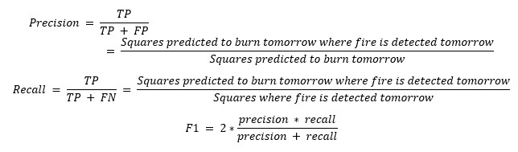

# **User Guide**

This application is designed to be opened daily for users to view current fires and the predicted spread of those fires. In this proof of concept stage the application is not receiving regular updates so users can only view past data through January 2022. Users can review the map and list of fires to identify fires in their jurisdiction. This tool also provides historical fire information (including past predictions), accuracy metrics, and relevant documentation. Users can navigate through the application using the left hand side bar. The sections below describe the functionality of each tab in the application.

## Home Page

When the application is launched, users will be taken to the Home Page, which contains introductory information that outlines the purpose and audience for the application.

## User Guide

This document can be found in the User Guide tab. Users can navigate back to this tab for instructions on using the application.

## Predictions and History: Viewing Fires of Interest

Two tabs allow users to view fires of interest and associated predictions. The Predictions tab allows users to view fires burning on the date selected and the potentially impacted areas that are at risk for the fires to spread the following day. The History tab allows users to view all fires that occurred within a selected date range without predictions.

### Predictions

In the Predictions tab, select a date of interest using the &quot;Date&quot; selection box. Prediction data is only available January 2021 - January 2022.

Users can filter the results of the predictions by selecting a confidence threshold with the &quot;Confidence&quot; slider bar. This will limit the displayed results to only those fires and potentially impacted areas with predictions at or above the selected confidence.

Fires will be visible on the map view as red dots. Users can zoom in to fires of interest in one of two ways:

- Select a &quot;Fire # &amp; Potentially Impacted Counties&quot; from the drop-down menu beneath the date selector. The counties that are potentially impacted by the selected fire are listed next to the fire number in the drop down. The map will zoom in automatically to the selected fire upon clicking the fire number.
- Zoom in manually on the map view where red dots are visible (see Map Functionality below for instructions on how to zoom).

Note: If you move the confidence slider bar the map will reload. If you have selected a fire, the map will stay zoomed in, but if you have manually zoomed to an area on the map, the map will reload to its original zoom and you will need to manually re-zoom.

Once zoomed in, users will see a set of red dots and typically one or more blue boxes. The red dots are representative of current fire locations on the selected date. The blue boxes are representative of the potentially impacted areas in which the nearby fires are predicted to spread. Users can hover over a blue box to view the confidence level of the prediction as well as whether fire actually burned in that area after the prediction.

Clicking on a predicted square will generate its force plot under the map. The red, right-pointing arrows represent features that had a positive contribution on the output (confidence level) and the blue, left-pointing arrows represent features that had a positive contribution. The size of the arrow corresponds to the magnitude of the contribution. The larger arrows are labeled with the corresponding feature and its value in the form of _FeatureName = value_ and these labels can be uncovered for the smaller arrows by hovering over them. Note that this _value_ is the actual value of the feature used as model input rather than the feature&#39;s marginal contribution - the latter is only represented by the size of the arrow. The final insight from the plot is the output (confidence level in decimal form) in bold. The output is equal to the sum of every feature's marginal contribution plus the average output across all predictions.

### History

In the History tab, users can select a date range of interest using the &quot;Date&quot; selection box. Once a date range is selected, the fires that occurred during that time will be displayed on the map as red dots. Users can zoom in to fires of interest in the same manner as in the Predictions tab.

### Map Functionality

Hover over the upper right corner of the map in either the Predictions or History tabs to view the following additional map functionality:

- Download plot as a png: allows users to click the camera icon to download a snapshot of the current map view.
- Pan: allows users to click and drag the map to view different locations.
- Zoom in/Zoom out: allows users to control the zoom level on the map (alternatively, users may use the scroll wheel on their mouse to zoom in and out).
- Reset view: sets the map back to the view seen when the application was first accessed.

## Evaluation

Accuracy metrics can be viewed through the Evaluation tab. Users can select a date range and confidence level in the same manner as the Predictions tab to view recall, precision, F1 score, and a confusion matrix for the time period and confidence level selected.

**Confusion Matrix**

The confusion matrix summarizes the performance of a classification model. The rows represent the actual (AKA truth) classes and the columns represent the predicted classes. The two classes in our use case are &quot;fire&quot; and &quot;no fire&quot;. The cells in the matrix indicate the total occurrences of the result corresponding to the actual class in that row and the predicted class in that column. The four results/cells are:

True Positive (TP): A square where fire is detected tomorrow, and where the model predicted that it will burn

False Negative (FN): A square where fire is detected tomorrow, and where the model predicted that it will not burn

True Negative (TN): A square where fire is not detected tomorrow, and where the model predicted that it will not burn

False Positive (FP): A square where fire is not detected tomorrow, and where the model predicted that it will burn

**Metrics**

## Modeling Details

The Modeling Details tab contains documentation describing the modeling approach used to predict the potentially impacted areas displayed in the Predictions tab, as well as relevant references used in the development of this model and application.

## Troubleshooting

If no fires are visible on the map (i.e., map is blank) and/or no fires are available in the &quot;Fire # &amp; Potentially Impacted Counties&quot; dropdown, select another date and try again. If no fires are visible, there were no active fires on that day. Actual fire data is available from 01/01/2014 - 02/01/2022 and predictions are available 01/01/2021 - 2/01/2022. No fires will be viewable outside of that date range. The development team suggests trying out the following dates to best explore application functionality:

- July 2021 - September 2021

Fire data is not available for the following dates:  
2021-01-02  
2021-01-31  
2021-02-11  
2021-02-14  
2021-02-15  
2021-03-18  
2021-04-25  
2021-08-04  
2021-10-23  
2021-10-24  
2021-11-01  
2021-12-06  
2021-12-12  
2021-12-13  
2021-12-22  
2021-12-23  
2021-12-28  
2021-12-29  
